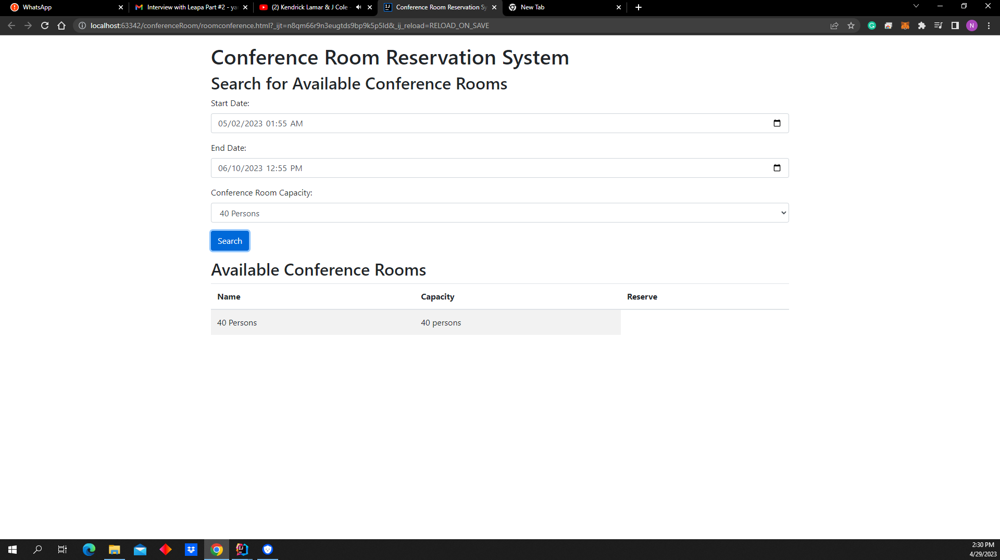
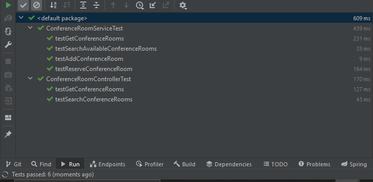

# Conference Room test application

### Work done

Per the specifications, the application was developed with respect to the user cases:

* Unit & Integration test done
* ConferenceRoom and Reservation has a one -to-many relationship
* Application uses InMemory Database different profile for test & runtime scope
* Implemented an Initializer to load data in our database in the DbInitializer.java file
* Two Conference rooms are created Room 1 & Room 2, then Room 1 is reserved for we would reserve room1, for the period of May 1st - 31st May 2023
* Authorization of API not yet setup, assumption not within scope of test
* Client web app implemented roomconference.html and app.js, a screenshot is illustrated below

### How to run the app

Using an JAVA IDE such as IntelliJ IDEA or netbeans, eclipse:

* Import the zip of this project file, or extract the content and open run the application
* The application runs on the default port, 8080, incase you modify the port, update the client rest api method in the file app.js

The above image is an illustration of the user search room use case

Below is the test result, all the test are ok.

